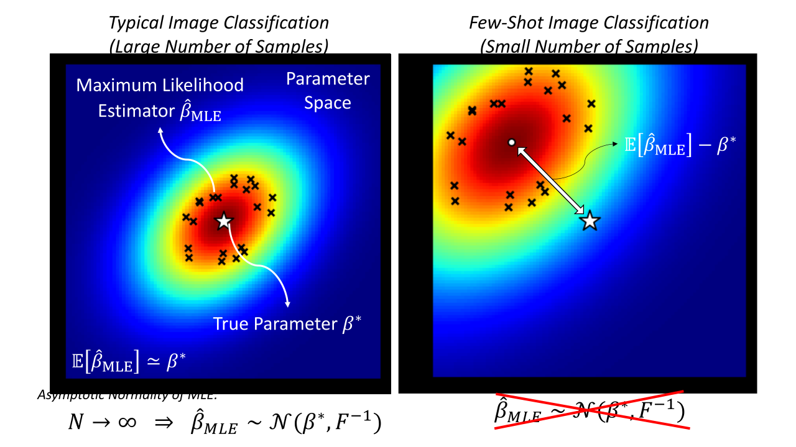
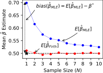
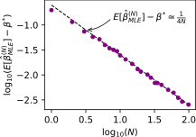
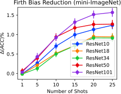
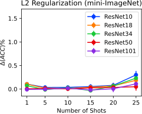

# Firth Bias Reduction in Few-shot Classification Repository
This repository contains the core experiments conducted in the [On the Importance of Firth Bias Reduction in Few-Shot Classification](https://openreview.net/pdf?id=DNRADop4ksB) paper.

<details open>
<summary><h2>The Paper in Pictures</h2></summary>

  + <details open>
    <summary><strong>The MLE Bias in Few-shot Classification</strong></summary>
  
    Here is a visualization to help you get the overall context of typical loss minimization (MLE) bias with only a few samples.

    

    </details>
  
  + <details>
    <summary><strong>Firth Bias Reduction in Few Words</strong></summary>
   
    + <details open>
      <summary><strong>For 1-Layer Logistic and Cosine Classifiers with the Cross-Entropy Loss</strong></summary>

      All you need to do, is replace
      
      <p align="center"></p>
      
      with
  
      <p align="center"></p>
     
      where U is the uniform distribution over the classes, and lambda is a positive constant. The CE-term with the uniform distribution is basically the sum of the prediction log-probability values over all data points and classes. 
    
      </details>
  
    + <details>
      <summary><strong>General Firth Bias Reduction Form</strong></summary>
  
      Add a log-det of FIM term to your loss minimization problem. That is, replace
      
      <p align="center"></p>
      
      with 
      
      <p align="center"></p>,
      
      This was proven to reduce the bias of your estimated parameters.
      </details>
    
    </details>
  
  
      

  + <details>
    <summary><strong>Firth Bias Reduction in a Geometric Experiment</strong></summary>
  
    Here is a simple example show-casing average the MLE's bias from the true parameters in a geometric experiment with a fair coin, and the slow rate at which this bias disappears.

     

    </details>

  + <details>
    <summary><strong>Firth Bias Reduction Improvements in Few-shot Classification Tasks</strong></summary>
  
    Here is the effect of Firth bias reduction campared to typical L2 regularization in 16-way few-shot classification tasks using basic feature backbones and 3-layer logistic classifiers.

     

    </details>

</details>

<details>
<summary><h2>Nice Code Features</h2></summary>

  We tried to structure the code as **user-friendly** as possible. Following features are worth considerations:
  1. **GPU Acceleration**: Even the 1-layer classifier trainings are batched along the RNG seed dimension, and are accelerated to run on GPUs.
  2. **Reproducibility and Random Effects Matching**: All the randomization effects (such as the batch ordering, the parameter initializations, etc.) are controlled through rigorous seeding of the random generators. The results are tested to be deterministically reproducible (i.e., running the same code 10 times will give you the same exact result every time). This can be useful if you want to make a slight algorithmic change, and observe the difference; all the randomized effects will be matched between the two runs.
  3. **De-coupled Configurations from the Code**: You don't need to specify long lines of `argparse` argument specifications in a bash file. Instead, just take a quick look at [`./configs/01_firth_1layer/firth_1layer.json`](./configs/01_firth_1layer/firth_1layer.json) for an example. The running settings are specified in `json` files in the `configs` directory. You won't need to personally keep track of the arguments you passed to generate different results, since the settings will be permanently stored in the `configs` directory.
  4. **Code Quality**: We have used and tested this code rigirously in our work. There is even code to compute the maximum number of seeds in one batch when running each setting to avoid cuda out-of-memory errors. All this is being done automatically behind the scenes.
  4. **Data Inclusion**: All the data needed to produce the figures and tables, including  
     1. the extracted features,
     2. the feature backbone parameters,
     3. the datasets,
     4. the experimental results and data,
     5. the generated figures and tables, etc.

      are either included in the repository themselves, or a google-drive link to them with automated downloading scripts is included.
  5. **Download Automation**: Downloading heavy feature files, datasets, or backbone parameters manually, and then transferring them to a cluster storage can be difficult and time-consuming. To alleviate this, we included automated downloading scripts for each of these elements. Just take a look at [`./features/download.sh`](./features/download.sh); all the google drive links are included, a script will download them for you, and verify their correctness using the md5 checksums included in the repo. These scripts were tested multiple times at the time of writing, and if a breaking update happens to the google-drive api in the future, we will modify the download code to fix the issue as soon as you let us know!
  6. **Python Environment Specification**: Not only we provide our exact python library dependencies and versions in the [`requirements.txt`](./requirements.txt) file, we also offer some automated helper scripts to create virtual environments. If you'd rather run your code in an environment of your choosing, that is totally fine as well.

  Just give this code a try; it won't take much of your time to set up. You may even find it a good starting point for your own FSL projects :)
</details>

<details>
<summary><h2>Quick Q&A Rounds</h2></summary>

1. **Question**: Give me a quick-starter code to start reproducing the paper trainings on a GPU?
   ```bash
   git clone https://github.com/ehsansaleh/firth_bias_reduction.git
   cd ./firth_bias_reduction/code_firth
   ./features/download.sh
   ./main.sh
   ```
---------
2. **Question**: Give me a simple python command to run?
   ```bash
   python main.py --device cuda:0 --configid "01_firth_1layer/firth_1layer"
   ```

    <details>
    <summary><strong>More Information</strong></summary> 
    
    This will
      * run the configuration specifed at [`./configs/01_firth_1layer/firth_1layer.json`](./configs/01_firth_1layer/firth_1layer.json), and
      * store the generated outputs periodically at `./results/01_firth_1layer/firth_1layer.csv`.
     </details>

---------
3. **Question**: How can I reproduce the paper figures/tables?

   ```bash
   make summary
   make figures
   make tables
   ```
  
   <details>
   <summary><strong>More Information</strong></summary>
   
   1. If you have run new classifier trainings by either `./main.sh` or `python main.py`, then run `make summary`. Otherwise, skip this step. This command will collect the csv files from the `./results` directory, and process them into a single summarized file at [`./summary/val2test.csv`](./summary/val2test.csv).
   2. Run `make figures` to refresh the PDF figures at the [`./figures`](./figures) directory.
   3. Run `make tables` in case you're interested about the raw numbers at the [`./tables`](./tables) directory.
   
   </details>


---------
4. **Question**: I have my own code and I do not want to use your code. How can I apply the Firth bias reduction to my own loss?

   ```python
   ce_loss = nn.CrossEntropyLoss()
   ce_term = ce_loss(logits, target)
  
   log_probs = logits - torch.logsumexp(logits, dim=-1, keepdim=True)
   firth_term = log_probs.mean()
  
   loss = ce_term + lam * firth_term
   loss.backward()
   ```
   
   * Alternatively, you can use the `label_smoothing` keyword argument in [`nn.CrossEntropyLoss`](https://pytorch.org/docs/stable/generated/torch.nn.CrossEntropyLoss.html). 
  
   * Remember that this Firth formulation is only true for 1-layer logistic and cosine classifiers. For more complex networks, the FIM's log-determinant must be worked out.
  
---------
   <details>
   <summary>4. <strong>Question:</strong> You seem to have too many directories, files, and a fancy structure. Explain the whole thing as simple as possible?</summary>
   
   
     
   ```
                    ./main.sh or
                   python main.py                  make summary                  make figures    
   configs/*.json ================> results/*.csv =============> summary/*.csv ===============> figures/*.pdf
                         /\                                                       make tables      tables/*
                         ||
            (below is    ||
             optional    ||
              parts)     ||
                         ||                      python utils/datasets.py                   
                         ======= features/*.pt <========================== backbones/*.pt
                                                                                 /\
                                                                                 ||
                                                                                 ||
                                              python opt/train_backbone.py ============== datasets/*
                                               or ./opt/train_backbone.sh
   ```

   The top horizontal line is the important one.

   </details>
  
---------
   <details>
   <summary>5. <strong>Question:</strong> What are the python environment package requirements?</summary>
   
   * We ran the code using `python 3.8`.
     
   * The classifier training code mainly needs `numpy`, `torch`, `torchvision`, and `pandas`.
     
   * For generating the figures, you also need `matplotlib`, `seaborn`, etc.
     
   * If you don't like messing up with your own environment, just run `make venv` in the terminal. This will create a virtual environment at `./venv` and install our specified dependencies. Our shell scripts (e.g., `./main.sh`) will automatically activate and use this environment once it exists.
     
   * If you'd like our shell scripts to use and activate your own conda/virtualenv environment, feel free to edit the `.env.sh` under the environement activation section and add your custom activation lines. We source the `.env.sh` code in all of our shell scripts, so your changes will automatically have a global effect.
     
   </details>

</details>

<details open>
<summary><h2>Step-by-Step Guide to the Code</h2></summary>
   
+  <details>
   <summary><strong>Cloning the Repo</strong></summary>

   1. `git clone https://github.com/ehsansaleh/firth_bias_reduction.git`
   2. `cd ./firth_bias_reduction/code_firth`

   </details>
   
+  <details>
   <summary><strong>Download the Features</strong></summary>

   1. To use our pre-computed features, run `./features/download.sh`
   2. **[Optional]** If you like to download the base class features, run `./features/download.sh base`

   </details>
   
+  <details>
   <summary><strong>[Optional] Make a Virtual Environment</strong></summary>
   
   1. Activate your favorite python version (we used 3.8).
   2. Run `make venv`.
   3. This will take a few minutes, and about 1 GB in storage.
   4. The virtual environment with all dependencies will be installed at `./venv`.
   5. You can run `source ./venv/bin/activate` to activate the venv.
   6. Our shell scripts check for the existence of `venv`, and will use/activate it.
   
   </details>

+  <details>
   <summary><strong>Training Few-shot Classifiers</strong></summary>
   
   +  <details>
      <summary><strong>[Manual Approach]</strong></summary>
   
      * To fire up some training yourself, run

        `python main.py --device cuda:0 --configid "01_firth_1layer/firth_1layer"`
      * This command will read the `./configs/01_firth_1layer/firth_1layer.json` config as input.
      * The computed accuracy statistics would be saved at  `./results/01_firth_1layer/firth_1layer.csv`.
      * Typically, this config may take a few hours to finish on a V100 GPU.
      * If you have multiple GPUs and would like to split the config into chunks, you can run the following:

        `python utils/json_splitter.py -c 01_firth_1layer/firth_1layer -v firth_coeff_list -n 4`
         * This will split `configs/01_firth_1layer/firth_1layer.json` into 4 config files.
         * `configs/01_firth_1layer/firth_1layer_part0.json` is the first part's config.
         * The splitting will happen along the `"firth_coeff_list"` variable.
         * To train the first part, add `"_part0"` to the config id:

           `python main.py --device cuda:0 --configid "01_firth_1layer/firth_1layer_part0"`.
      </details>
   
   +  <details open>
      <summary><strong>[Shell Script's Automated Array]</strong></summary>

      * Check-out and run [`./main.sh`](./main.sh).
      * The shell script performs some inital sanity checks and activations.
      * Then it will go through the `CFGPREFIXLIST` config array sequentially.
      * Feel free to add or take off configs from the array. 
      </details>
   
   </details>

+  <details>
   <summary><strong>Summarizing the Results</strong></summary>

   Run `make summary` 
   +  <details>
      <summary><strong>The Summary Output</strong></summary>

      This step generates the following 3 files.
      1. [`./summary/val.csv`](./summary/val.csv) summarizes the accuracy statistics on the validation split.
      2. [`./summary/test.csv`](./summary/test.csv) summarizes the accuracy statistics on the novel split.
      3. [`./summary/val2test.csv`](./summary/val2test.csv) summarizes what happens when you validate the coefficients.
         * That is, what the accuracy improvements are when you pick the best coefficient from the validation set and apply it to the novel set.

      You can use these summarized CSV files to generate your own plots. Basically, `./summary/val2test.csv` has all the data we showed in our paper!
      </details>
   
   +  <details>
      <summary><strong>More Information</strong></summary

      Here are some pointers to understand what `make summary` just did:
      1. In the previous step, you have run a bunch of Few-shot classification tasks 
         1. on both the validation and novel sets,
         2. both when the firth bias reduction was turned on or off,
         3. etc.
      2. The statistics for each task were computed and stored in csv files in the results directory.
      3. Now, you wish to see how much difference Firth or L2 made, and perform validation to pick the best coefficient. 
         * This is what we call the summarization step.
      3. During the summarization:
         1. we take all the generated `./results/*.csv` files from the previous step,
         2. summarize them into a single small csv file at [`./summary/val2test.csv`](./summary/val2test.csv). 
      4. The [`./summary/val2test.csv`](./summary/val2test.csv) file includes
         1. the validated coefficients, 
         2. the average un-regularized accuracy values,
         3. the average accuracy improvement at test time, and
         4. what the error/confidence intervals look like

      as response columns. Each row will denote a specific configuration (e.g., a specific resnet, number of shots, number of ways, etc. combination) averaged over many seeds.
      </details>

   </details>

+  <details>
   <summary><strong>Generating Our Figures</strong></summary>
   
   Run `make figures`. 
   
   * This will refresh the contents of the `figures` directory with new pdf plots.
   
   </details>

+  <details>
   <summary><strong>Generating Our Tables</strong></summary>

   Run `make tables`. 
   
   * This will refresh the contents of the `tables` directory with new tex/csv tables.
   
   </details>

+  <details>
   <summary><strong>[Optional] Download The Pre-trained Feature Backbone Parameters</strong></summary>
   
   Run  `./backbones/download.sh`
   
   </details>

+  <details>
   <summary><strong>[Optional] Download or Link the Datasets</strong></summary>
   
      Run `./datasets/download.sh`
         
      1. This shell script will only populate the mini-imagenet and CIFAR-FS datasets. 
         
      2. For tiered-imagenet, link an extracted image-net directory:

         `ln -s /path/to/imagenet/root/dir ./datasets/tieredimagenet`
            
      3. After linking `./datasets/tieredimagenet/n01440764/n01440764_10026.JPEG` should exist.
         
   </details>

+  <details>
   <summary><strong>[Optional] Train Feature Backbones</strong></summary>
   
   +  <details>
      <summary><strong>[Manual Approach]</strong></summary>

      `python opt/train_backbone.py --device cuda:0 --resnet_no 10 --dataset miniimagenet`
   
      * This will create the following checkpoints:
        * `./backbones/miniimagenet_resnet10_v2_best.pth.tar`
        * `./backbones/miniimagenet_resnet10_v2_last.pth.tar`
      * The code has resuming capability from the checkpoints.
      </details>
   
   +  <details open>
      <summary><strong>[Shell Script Automated Array]</strong></summary>
   
      * Check-out and run [`./opt/train_backbone.sh`](./opt/train_backbone.sh)
      </details>
   
   </details>

   
+  <details>
   <summary><strong>[Optional] Generate Features from Trained Backbones</strong></summary>

   +  <details>
      <summary><strong>[Manual Approach]</strong></summary>
   
      * Here is a minimal python example:
        ```python
        from utils.datasets import MiniImageNet, make_backbone, torch, FeaturesDataset
        
        input_ckpt_path = './backbones/my_resnet10_miniimagenet.pth.tar'
        output_feats_path = './features/my_resnet10_minimiagenet_novel.pt'
        
        imgset = MiniImageNet(f'../datasets/miniimagenet', 'novel', transform=transform)
        img_loader = torch.utils.data.DataLoader(imgset, batch_size=32, shuffle=False)
        feature_model = make_backbone('resnet10', input_ckpt_path, 'cuda:0')
        featset = FeaturesDataset(output_feats_path, feature_model=feature_model, 
                                  img_loader=img_loader, device='cuda:0')
        ```
      </details>
   
   +  <details open>
      <summary><strong>[Automated Python Loop]</strong></summary>
   
      * We have provided a sample script in [`utils/datasets.py`](./utils/datasets.py).
      * Look under the `if __name__=='__main__':` condition.
      * There is a `for` loop that generated our own feature sets.
      * Feel free to read the code and modify it to use your own backbones and datasets.
   
      </details>
   
   </details>

</details>
   
<details>
<summary><h2>Configurations and Arguments</h2></summary>

+ <details open>
  <summary><strong>Example</strong></summary>

  We have included all the configurations we used to produce the results in our paper in the [`./configs`](./configs) directory. 

  There are a total of 11 json configuration files for our paper.

  You can take a look at [`configs/01_firth_1layer/firth_1layer.json`](./configs/01_firth_1layer/firth_1layer.json) for an example:
  ```json
  {
    "description": "Firth bias reduction with 1-layer classfiers (the left panel of Figure 2)",
    "date": "March 20, 2022",
    "start_seed" : 0,
    "num_seeds" : 1000,
    "clf_type": "lin",
    "dataset_name_list": ["miniimagenet"],
    "backbone_arch_list" : ["resnet10", "resnet18", "resnet34", "resnet50", "resnet101"],
    "data_type_list" : ["val", "novel"],
    "n_shots_list" : [1, 5, 10, 15, 20, 25],
    "firth_coeff_list" : [0.0, 0.01, 0.03, 0.1, 0.3, 1.0, 3.0, 10.0],
    "entropy_coeff_list": [0.0],
    "l2_coeff_list" : [0.0],
    "n_ways_list": [16],
    "firth_prior_type_list": ["uniform"],
    "learning_rate": 0.005,
    "batch_size": 10,
    "n_epochs": 400,
    "optim_type": "sgd",
    "shuffle_mb": true,
    "n_query": 60,
    "fix_query_set": true,
    "nshots_to_clsfreqs": null,
    "permute_labels": false,
    "store_results": true,
    "store_predictions": false,
    "store_clfweights": false,
    "torch_threads": 4,
    "dump_period": 10000
  }
  ```
  
  * Note that our code runs the cartesian product of all arguments ending with `_list`. 
    * For instance, there is `480=1*5*2*6*8*1*1*1*1` different settings to try in the above config file.
    * Each of these settings runs with 1000 different random seeds, creating a total of 480,000 tasks to perform.
    * This config can be completed in a few hours on a typical P100 or V100 GPU.
  </details>
  
+ <details>
  <summary><strong>Brief Argument Descriptions</strong></summary>
  
  * `"description"` and `"data"` fields are just notes to yourself for future references.
  * `"start_seed"` and `"num_seeds"` determine the range of random seeds that will be run.
    * Having `"start_seed" : 0, "num_seeds" : 1000` runs all the `0, 1, 2, 3, ..., 999` seeds.
    * Since we use randomized effect matching, you don't need 10,000 seeds for improvement stats.
  * `"clf_type:` determines the classifier type.
    * It can either be `"lin"` or `"mlp"`. 
    * For 1-layer logistic classifiers use the `"lin"` option. 
    * For 3-layer logistic classifiers, use the `"mlp"` option.
  * `"dataset_name_list"` is a list of dataset names:
    * It should be a subset of `["miniimagenet", "cifarfs", "tieredimagenet"]`.
  * `"data_type_list"` is a list of data splits to go through:
    * It should be a subset of `["base", "val", "novel"]`.
  * `"n_shots_list"` specifies a list of number of shots to test.
  * `"firth_coeff_list"` specifies a list of firth bias reduction coefficients to iterate over. 
    * Please note that we train a model for each coefficient, and evaluate its accuracy. 
    * Later on, we use this information to perform the validation procedure when we summarize the results.
  * `"entropy_coeff_list"` specifies a list of entropy regularization coefficients. 
    * Setting this as `[0.0]` will disable this regularization. 
    * Entropy regularization (a.k.a. the confidence penalty) is different from firth bias reduction in that it swaps the order of predictions and the uniform distribution in the KL-divergence term.
  * `"l2_coeff_list"` specifies a list of L2 regularization coefficients to iterate over.
  * `"n_ways_list"` specifies a list of number of classes to perform few-shot classification tasks over.
  * `"firth_prior_type_list"` specifies a lit of firth prior types
    * It should be a subset of `["uniform", "class_freq"]`. 
    * The default `firth_prior_type` is the uniform one.
    * the `"class_freq"` case extracts the class distribution from the support data to replace the uniform distribution in Firth's KL-divergence term.
  * `"learning_rate"` is the learning rate for the classifier optimizer.
  * `"batch_size"` is the mini-batch size for the classifier's optimizer.
  * `"n_epochs"` is the number of epochs the classifier optimizer iterates over the support data.
  * `"optim_type"` is the optimizer type:
    * It should be a subset of `["sgd", "adam"]`. 
    * While we have also implemented the conjugate-gradient (`"cg"`) and the L-BFGS (`"lbfgs"`) optimizers, they haven't been upgraded for GPU usage and training multiple seeds along a batch dimension.
  * `"shuffle_mb"` specifies whether you would like the support set to be shuffled every time the optimizer goes through it. 
    * Stochastic GD methods would like to turn this option on for better optimization in theory.
    * This can come at a slight performance penalty. 
    * If you don't think the optimizer would be affected much, feel free to turn it off.
  * `"n_query"` is the number of query set samples to set aside for evaluation of the trained few-shot classifier.
  * `"fix_query_set"` is a boolean to fix the query set among all tasks. 
    * This reduces the evaluation variance.
    * If you turn this feature off, the query set will be randomized as a function of the random seed.
    * Obviously, randomizing the query set can require more runs to produce the same confidence intervals.
  * `"nshots_to_clsfreqs"` can be used to specify imbalanced class frequencies. 
    * It can be set to `null` to use balanced datasets.
    * Otherwise, it can be a dictionary with the number of shots as keys, and a list of integers with the same length as the number of ways representing the support class frequencies. 
    * See [`./configs/03_imbal_1layer/imbal_1layer.json`](configs/03_imbal_1layer/imbal_1layer.json) for an imbalanced setting example.
  * `"permute_labels"` can be used to shuffle the validation or novel classes to randomly choose for few-shot classification tasks. 
    * Since in this config we're using 16-way classification and mini-imagenet only has 16 validation classes, this parameter has no effect and was turned off. 
    * If you have an abundance of classes to choose from (like the tiered-imagenet dataset), and don't mind a bit extra variance, you should turn this option on.
  * `"store_results"` should mostly be set to true, so that the python script writes its results in a `./results/*.csv` file.
    * If you just want to take dry-runs to check for code integrity, you can turn this option off.
  * `"store_predictions"` specifies whether you want to record the trained classifier's prediction classes vs. the true ones.
    * This can be used to extract statistics other than accuracy later on. 
    * However, it forces the script to use `.h5` for the results for storage space efficiency.
  * `"store_clfweights"` specifies whether you want to store the trained classifier weights in a `./storage` directory.
    * Although this option has been implemented, we disabled it.
    * Writing to the storage for slow drives can be more time-consuming than the training itself. 
    * If you feel that your cluster storage is fast enough, feel free to remove those false assertions and raise statements in the `main.py` script, and turn this option on.
  * `"torch_threads"` sets the number of torch threads.
    * This is just in case you wanted to train the classifiers on a CPU device. 
    * The code was optimized to require the minimal CPU usage if a GPU was provided. 
    * Therefore, you can safely set this to a small number when using a GPU.
  * `"dump_period"` specifies the number of CSV lines that need to be buffered before flushing them to the disk. 
    * This was set to a large value to prevent frequent dumps to the disk and creating system call over-heads.

  </details>

</details>

<details>
<summary><h2>Extra Inner-working Details</h2></summary>

+ <details>
  <summary><strong>Downloading the Files</strong></summary>

    You can find the google-drive download link embedded in the download shell-scripts. For example, take the following snippet from the [`./features/download.sh`](./features/download.sh) script:
     ```commandline
     FILEID="1cf57AsY3IHxlDGEvB4RemDrbtU92aSM0"
     FILENAME="miniimagenet_novel.tar"
     GDRIVEURL="https://drive.google.com/file/d/1cf57AsY3IHxlDGEvB4RemDrbtU92aSM0/view?usp=sharing"
     PTHMD5FILE="miniimagenet_novel.md5"
     gdluntar ${FILEID} ${FILENAME} ${GDRIVEURL} ${PTHMD5FILE}
     ```
     This means that you can manually
     1. download the file from [`https://drive.google.com/file/d/1cf57AsY3IHxlDGEvB4RemDrbtU92aSM0/view?usp=sharing`](https://drive.google.com/file/d/1cf57AsY3IHxlDGEvB4RemDrbtU92aSM0/view?usp=sharing),
     2. name it `miniimagenet_novel.tar`,
     3. optionally, verify its checksum from `miniimagenet_novel.md5`, and then
     4. untar it yourself, and you'll be in business!

    The function `gdluntar` from [`./utils/bashfuncs.sh`](./utils/bashfuncs.sh) is used to automatically download the files. We have been using this method for downloading google-drive files for quite a few years, and it's been stable so far. In the event there was a breaking change in google's api, please let us know and feel free to edit this function if you know a better G-drive download method in the meantime.
  
  </details>

+ <details>
  <summary><strong>Python Environments and Libraries</strong></summary>

  The [`.env.sh`](./.env.sh) checks for the existence of this virtual environment, and if it detects its existence, it will automatically activate and use it in our shell scripts. You can change this behavior by replacing the `[[ -f venv/bin/activate ]] && source venv/bin/activate` line with your own custom environment activation commands (such as `conda activate` or similar ones).

  </details>
  
</details>
   
## References
* Here is the arxiv link to our paper:
  * The arxiv PDF link: [https://arxiv.org/pdf/2110.02529.pdf](https://arxiv.org/pdf/2110.02529.pdf)
  * The arxiv web-page link: [https://arxiv.org/abs/2110.02529](https://arxiv.org/abs/2110.02529)
* Here is the open-review link to our paper:
  * The open-review PDF link: [https://openreview.net/pdf?id=DNRADop4ksB](https://openreview.net/pdf?id=DNRADop4ksB)
  * The open-review forum link: [https://openreview.net/forum?id=DNRADop4ksB](https://openreview.net/forum?id=DNRADop4ksB)
* Our paper got a spot-light presentation at ICLR 2022.
  * We will update here with links to the presentation video and the web-page on `iclr.cc`.
* Here is the bibtex citation entry for our work:
```
@inproceedings{ghaffari2022fslfirth,
    title={On the Importance of Firth Bias Reduction in Few-Shot Classification},
    author={Saba Ghaffari and Ehsan Saleh and David Forsyth and Yu-Xiong Wang},
    booktitle={International Conference on Learning Representations},
    year={2022},
    url={https://openreview.net/forum?id=DNRADop4ksB}
}
```
